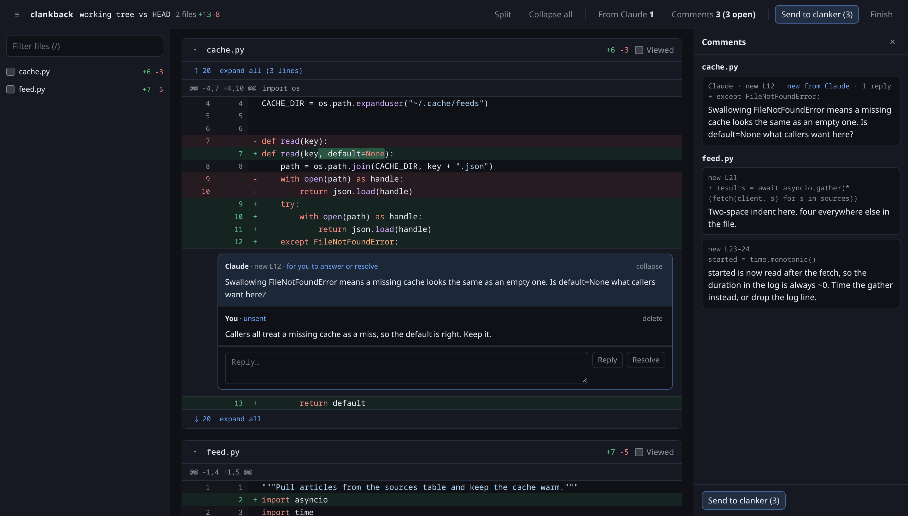

# clankback

Review a local diff in your browser the way you would review a pull request, and let Claude act on
the comments without switching back and forth between the document and the terminal.



## The loop

1. Run `/clankback` in Claude Code. The current diff opens in a browser tab.
2. Comment on a line, or drag down the gutter to comment on a range.
3. Click **Send to clanker** to send everything, or **Send** on one thread to send just that.
   Claude does the work, replies in the page, and resolves the thread.
   Typing an answer and clicking **Resolve** sends that thread straight away.
4. Claude can also ask you a question at a line. Answer it in the page and send again.
5. Click **Finish** when you are done.

Claude prints one line per round in the terminal. The rest stays in the page.

## Install

```sh
git clone <this repo> ~/repos/clankback
ln -s ~/repos/clankback ~/.claude/skills/clankback
```

It needs python3 and git. `gh` is only needed to review a GitHub pull request.

## What you can review

| Command | Diff |
| --- | --- |
| `/clankback` | working tree vs HEAD |
| `/clankback --staged` | index vs HEAD |
| `/clankback main` | working tree vs the merge base with `main` |
| `/clankback 1234` | GitHub pull request 1234 |
| `/clankback old.py new.py` | two files anywhere on disk |
| `/clankback src/ docs/` | any of the above, narrowed to those paths |
| `/clankback src/` outside a repo | the files under `src/` as new files, against an empty baseline |

Inside a repo, untracked files that are not ignored show as new files too.

`--resume` reopens the latest review left pending in the current directory; `--resume <target>` reopens that review even after Finish. `--discard` throws one away.

Colours: a thread's border is its state. Blue is a question from Claude waiting on you, green is
resolved, yellow is outdated and still open. White is the clanker: a light sweeps around a thread
it is working on, and a thread flashes white when it answers or points at a line.

## In the page

| Key | |
| --- | --- |
| `j` `k` | next, previous hunk |
| `n` `p` | next, previous file |
| `c` | comment on the focused line |
| `]` `[` | next, previous item from clanker |
| `v` | split or unified |
| `s` | the comment list |
| `b` | the file list |
| `/` | filter files |
| `?` | this list |

Comments are saved as you type them, so a reload costs you nothing. When the files change on disk
the diff re-renders in place and keeps your scroll position, so you can leave the tab open while
Claude edits.

## How it works

One Python file, standard library only. `clankback.py` starts a small server on localhost and serves
a single page to it. Review state lives in `~/.cache/clankback`, which is what lets a review survive
a closed tab. Claude answers from the terminal with `clankback.py reply <id>`, `resolve <id>`, `unresolve <id>`,
`ask <path>:<line>` and `show <id>`, and each one appears in the page within a couple of seconds.
